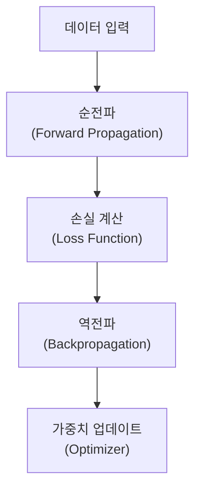

# Neural Network

## I. 생물학적 모방과 수학적 결합, Neural Network 개요

**정의**: 인간의 뇌 구조인 뉴런의 동작 방식을 모방하여, 다층의 노드와 가중치( **Weights** ) 결합을 통해 데이터의 비선형적 패턴을 학습하는 인공신경망 알고리즘  

**특징**:  
( **비선형성** ) 활성화 함수를 통해 복잡한 비선형 관계를 모델링 가능  
( **범용 근사자** ) 이론적으로 어떤 복잡한 함수도 근사할 수 있는 범용성( **Universal Approximator** ) 보유  
( **병렬 처리** ) 다수의 연산이 동시에 수행 가능한 구조로 GPU 가속에 최적화  

## II. Neural Network의 계층 구조 및 핵심 메커니즘

### 가. 신경망의 신호 전달 및 학습 프로세스

### 나. 핵심 구성 요소 및 상세 기능

| 구분 | 주요 요소 | 상세 설명 |
| :--- | :--- | :--- |
| **뉴런**(노드) | **Perceptron** | 입력을 받아 가중치를 곱하고 편향( **Bias** )을 더하는 기본 단위 |
| **활성화 함수** | **Activation Function** | 출력 신호를 변환하여 비선형성을 부여 (예: **ReLU**, **Sigmoid**, **Softmax**) |
| **손실 함수** | **Loss Function** | 실제값과 예측값의 차이를 측정 (예: **MSE**, **Cross-Entropy**) |
| **역전파** | **Backpropagation** | 연쇄 법칙( **Chain Rule** )을 이용해 출력층의 오차를 입력층 방향으로 전파 |
| **최적화** | **Optimizer** | 가중치를 갱신하여 손실을 최소화 (예: **SGD**, **Adam**, **RMSprop**) |

## III. Neural Network의 한계점 및 해결 방안

| 항목 | 문제점(Limit) | 해결 방안(Solution) |
| :--- | :--- | :--- |
| **기울기 소실** | **Vanishing Gradient** | **ReLU** 활성화 함수 사용 및 **Batch Normalization** 적용 |
| **과적합** | **Overfitting** | **Dropout**, **L1**/**L2 Regularization**, **Early Stopping** |
| **블랙박스** | **Explainability** | **XAI**(설명 가능한 AI) 기술 및 어텐션( **Attention** ) 맵 분석 |

**기술 동향**: 신경망이 깊어짐에 따라 발생하는 문제를 해결하며 **Deep Learning**으로 진화하였으며, 현재는 **Transformer** 구조를 통해 대규모 언어 모델( **LLM** )의 핵심 기반 기술로 사용됨
