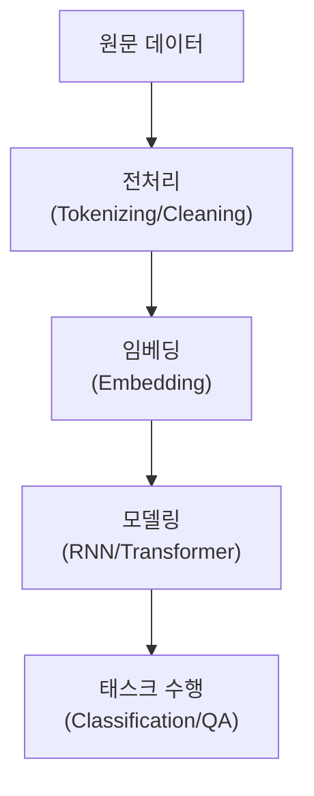

# Natural Language Processing (NLP)

## I. 인간의 언어와 기계의 소통, NLP 개요

**정의**: 인간이 사용하는 자연어를 컴퓨터가 이해, 분석, 생성할 수 있도록 하는 인공지능의 핵심 연구 분야  

**특징**:  
( **모호성 해결** ) 단어의 다의성, 문맥에 따른 의미 변화 등 언어의 복잡한 특성을 처리  
( **벡터화** ) 비정형 데이터인 텍스트를 수치 데이터인 벡터( **Vector** )로 변환하여 처리  
( **이해와 생성** ) 자연어 이해( **NLU** )와 자연어 생성( **NLG** )의 상호작용으로 구성  

## II. NLP의 주요 처리 단계 및 기술 요소

### 가. 텍스트 분석 파이프라인

### 나. 핵심 기술 및 기법

| 단계 | 주요 기술 | 상세 설명 |
| :--- | :--- | :--- |
| **전처리** | **Tokenization**, **Stemming**, **Stopword Removal** | 텍스트를 최소 단위로 분리하고 노이즈 제거 |
| **임베딩** | **Word2Vec**, **GloVe**, **FastText** | 단어를 고차원 공간상의 밀집 벡터로 변환 |
| **구문 분석** | **POS Tagging**, **NER** (개체명 인식) | 문장 성분 파악 및 주요 정보 추출 |
| **문맥 이해** | **Attention Mechanism**, **Self-Attention** | 단어 간의 상관관계를 파악하여 중요도 부여 |

## III. NLP의 주요 태스크 및 발전 단계

| 단계 | 핵심 모델 | 주요 특징 |
| :--- | :--- | :--- |
| **규칙 기반** | 정규 표현식, 사전 기반 | 정해진 규칙 내에서만 동작, 확장성 부족 |
| **통계 기반** | **N-gram**, **TF-IDF** | 단어 빈도와 통계적 확률에 의존 |
| **딥러닝 기반** | **RNN**, **LSTM**, **CNN** | 문맥의 특징을 자동 학습하기 시작 |
| **거대 모델** | **BERT**, **GPT**, **T5** | 대규모 사전 학습( **Pre-training** )을 통한 범용 성능 |

**기술 동향**: 현재 NLP는 특정 태스크를 수행하는 소형 모델에서 모든 언어적 업무를 수행할 수 있는 거대 언어 모델( **LLM** ) 시대로 완전히 전환됨
