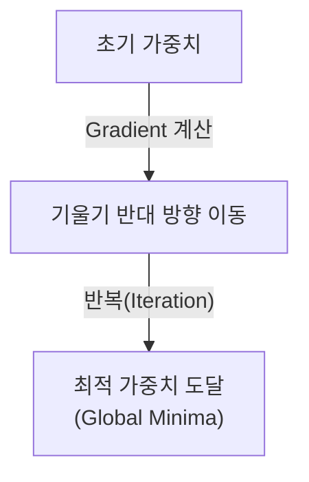
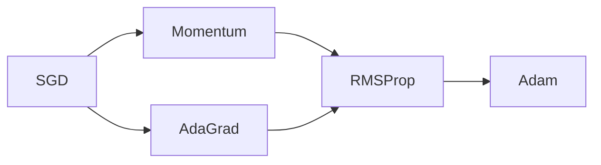

# Optimization (최적화)

## I. 최소 손실을 향한 수치적 탐색, Optimization 개요

**정의**: 모델의 출력값과 실제값의 차이인 손실 함수( **Loss Function** )를 최소화하기 위해 모델의 파라미터(가중치)를 체계적으로 조정하는 수학적 방법론  

**특징**:  
( **반복적 갱신** ) 한 번에 해를 구하는 것이 아니라 경사( **Gradient** )를 따라 조금씩 이동하며 최적해 탐색  
( **수렴성** ) 적절한 학습률( **Learning Rate** ) 설정을 통해 목표한 성능에 도달하게 하는 제어 기술  
( **안정성** ) 국소 최적해( **Local Minima** )나 안장점( **Saddle Point** )을 회피하며 학습의 안정성 확보  

## II. 주요 최적화 알고리즘 및 메커니즘

### 가. 옵티마이저(Optimizer)의 진화 계보

### 나. 핵심 최적화 기법 비교

| 알고리즘 | 특징 | 상세 설명 |
| :--- | :--- | :--- |
| **SGD** | **Stochastic Gradient Descent** | 데이터 일부(배치)만 사용하여 빠르게 기울기를 계산하고 갱신 |
| **Momentum** | 관성 적용 | 진행하던 방향으로 가속도를 붙여 로컬 미니마 탈출 지원 |
| **AdaGrad** | 학습률 조정 | 많이 변한 변수는 적게, 적게 변한 변수는 많이 학습하도록 자동 조절 |
| **Adam** | **Momentum + RMSProp** | 방향(관성)과 보폭(적응형 학습률)을 모두 고려한 범용 옵티마이저 |

## III. 최적화 시 고려사항 및 기술적 한계

| 항목 | 상세 내용 |
| :--- | :--- |
| **Learning Rate** | 너무 크면 발산하고, 너무 작으면 수렴 속도가 지나치게 느려짐 |
| **Batch Size** | 배치 크기에 따라 학습의 안정성과 일반화 성능이 달라짐 ( **Generalization Gap** ) |
| **Regularization** | 가중치 감쇠( **Weight Decay** ) 등을 통해 복잡도를 제어하고 과적합 방지 |

**기술 동향**: 최근에는 대규모 모델( **LLM** ) 학습을 위해 메모리 효율을 극대화한 **AdamW**, **Lion**, **Adafactor** 등 고도화된 최적화 알고리즘이 지속적으로 연구되고 있음
