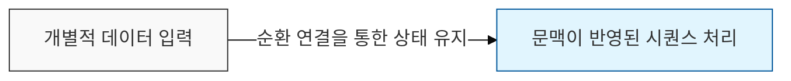
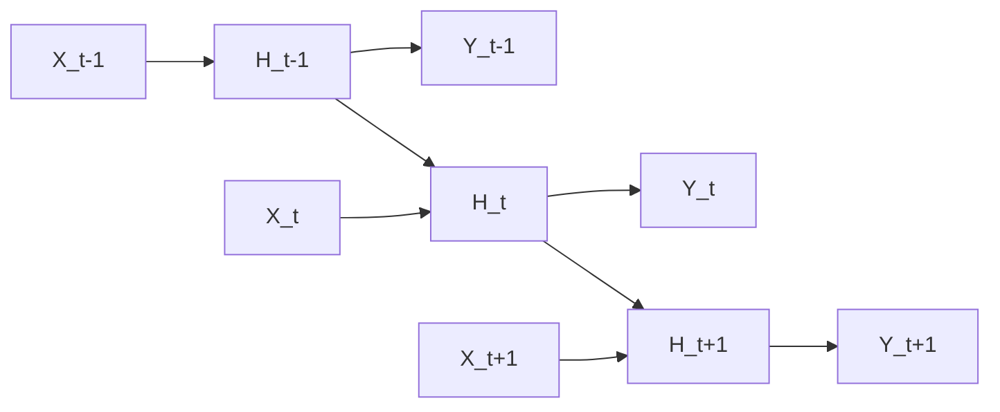

# Recurrent Neural Networks (RNN)

## I. 순차 데이터의 기억과 처리, RNN 개요

**정의**: 유닛 간의 연결이 순환 구조를 이루어 과거의 정보를 현재의 처리에 반영함으로써 시계열이나 텍스트 같은 순차적 데이터( **Sequential Data** )를 처리하는 신경망  

**특징**:  
( **가변 길이** ) 입력과 출력의 길이에 제한이 없어 자연어 처리나 음성 인식에 적합  
( **상태 유지** ) 이전 단계의 정보를 은닉 상태( **Hidden State** )에 저장하여 일종의 메모리 역할 수행  
( **파라미터 공유** ) 모든 시점( **Time-step** )에서 동일한 가중치를 사용하여 시간적 패턴 학습  

## II. RNN의 구조적 한계와 발전 모델

### 가. RNN의 시간 전개(Unrolling) 및 학습 방식

### 나. 주요 변형 모델 및 특징

| 모델명 | 특징 및 메커니즘 | 해결 과제 |
| :--- | :--- | :--- |
| **Vanilla RNN** | 가장 단순한 순환 구조 | 단기 기억 문제 |
| **LSTM** | **Forget**/**Input**/**Output Gate**를 통해 장기 기억 유지 | **Long-term Dependency** |
| **GRU** | **LSTM**을 간소화하여 업데이트와 리셋 게이트로 구성 | 연산 효율성 향상 |
| **Bi**-**RNN** | 과거와 미래의 정보를 모두 활용하기 위해 양방향으로 연결 | 문맥 이해도 향상 |

## III. RNN의 응용 분야 및 한계점

| 항목 | 상세 내용 |
| :--- | :--- |
| **주요 응용** | 기계 번역, 음성 인식, 주가 예측, 텍스트 생성 ( **Sequence Generation** ) |
| **장기 의존성 문제** | 시퀀스가 길어질수록 앞부분의 정보가 소실되는 현상 ( **Vanishing Gradient** ) |
| **병렬 처리 한계** | 이전 시점의 결과가 필요하여 **GPU**를 통한 대규모 병렬 연산이 어려움 |

**기술 동향**: RNN 계열은 오랜 시간 순차 데이터 처리의 표준이었으나, 병렬 처리가 가능하고 장기 의존성 문제를 획기적으로 해결한 **Transformer**의 등장 이후 많은 분야에서 대체되는 추세임
