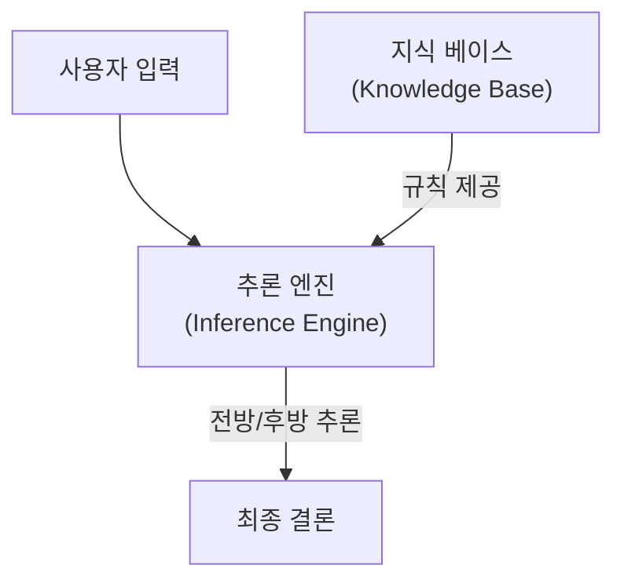

# Rule-based AI

## I. 확정적 로직의 구현, Rule-based AI 개요

**정의**: 지식 베이스와 추론 엔진을 바탕으로, 사람이 사전에 정의한 명시적인 규칙( **Explicit Rules** )에 따라 의사결정을 수행하는 인공지능 시스템  

**특징**:  
( **가독성** ) 규칙이 자연어 형태로 작성되어 전문가 및 비전문가 모두 이해하기 용이함  
( **결정론** ) 동일한 입력값에 대해 항상 동일한 출력값을 보장하는 높은 투명성 확보  
( **제어권** ) 개발자가 시스템의 모든 동작 논리를 직접 통제 가능한 `"**White-box**"` 모델  

## II. Rule-based AI의 상세 메커니즘 및 구성 요소

### 가. Rule-based AI의 추론 메커니즘

### 나. 핵심 구성 요소 및 상세 기능

| 구성 요소 | 상세 설명 | 비고 |
| :--- | :--- | :--- |
| **지식 베이스** | 도메인 전문가의 경험과 지식을 `IF-THEN` 구조로 정형화하여 저장 | **Knowledge Base** |
| **추론 엔진** | 입력된 데이터와 지식 베이스의 규칙을 대조하여 논리적 결론 도출 | **Inference Engine** |
| **작업 메모리** | 추론 과정에서 발생하는 중간 결과물과 현재 입력 데이터를 일시 저장 | **Working Memory** |
| **사용자 인터페이스** | 시스템의 판단 근거를 제시하고 사용자의 추가 입력을 수용하는 통로 | **Interface** |

## III. 기술 비교 및 발전 방향

### 가. Rule-based AI와 Machine Learning 비교

| 비교 항목 | Rule-based AI | Machine Learning |
| :--- | :--- | :--- |
| **지식 획득** | 인간 전문가가 규칙을 직접 정의 | 대량의 데이터로부터 패턴 자동 학습 |
| **설명 가능성** | 결과 도출 과정의 명확한 설명 가능 | 상대적으로 추론 근거 파악이 어려움 |
| **유연성** | 정의된 규칙 범위 내에서만 작동 | 미지의 데이터에 대한 일반화 성능 우수 |
| **데이터 요구량** | 데이터가 적어도 시스템 구축 가능 | 학습을 위한 대량의 데이터 세트 필수 |

### 나. 최신 기술 트렌드

( **Neuro-symbolic** ) 최근에는 규칙 기반의 신뢰성과 딥러닝의 유연성을 결합하여 복잡한 비즈니스 제약을 보장하는 하이브리드 모델이 주목받고 있습니다.  
( **LLM Integration** ) 거대 언어 모델의 결과물에 특정 제약 조건을 강제하거나 검증하는 논리 계층으로 활용되는 추세입니다.  
