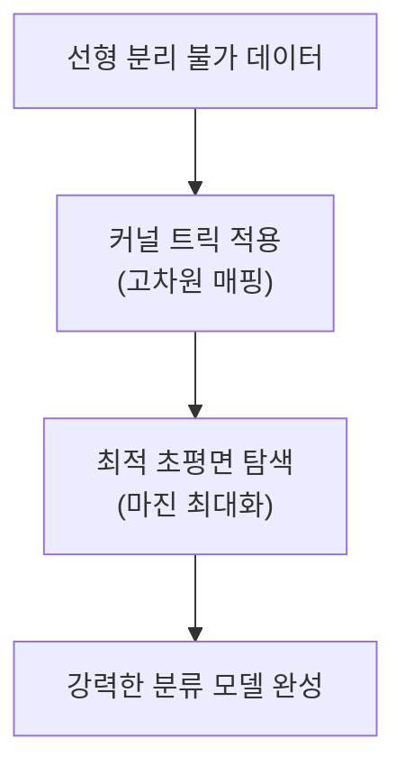

# Support Vector Machines (SVM)

## I. 최대 마진을 통한 결정 경계의 최적화, SVM 개요

**정의**: 두 클래스 사이의 거리인 마진( **Margin** )을 최대화하는 초평면( **Hyperplane** )을 찾아 데이터를 분류하거나 회귀를 수행하는 지도 학습 알고리즘  

**특징**:  
( **최대 마진** ) 단순히 나누는 것이 아니라 오차에 대한 여유 공간인 마진을 극대화하여 일반화 성능 확보  
( **서포트 벡터** ) 결정 경계를 결정하는 데 영향을 주는 경계선 근처의 데이터 포인트들( **Support Vectors** )만 사용  
( **커널 트릭** ) 저차원에서 해결 안 되는 문제를 고차원으로 매핑하여 선형 분리 가능하게 처리  

## II. SVM의 핵심 메커니즘 및 기술 요소

### 가. 결정 경계와 마진의 원리

### 나. 주요 구성 요소 및 기법

| 요소 | 상세 설명 | 비고 |
| :--- | :--- | :--- |
| **초평면** | 데이터를 두 클래스로 분리하는 N차원 공간의 평면 | **Decision Boundary** |
| **마진** | 결정 경계와 가장 가까운 데이터(서포트 벡터) 사이의 거리 | **Max Margin** |
| **커널 트릭** | 데이터를 고차원 공간으로 변환하여 비선형 문제를 해결 (예: **RBF**, **Polynomial**) | **Kernel Trick** |
| **슬랙 변수** | 약간의 오분류를 허용하여 모델의 유연성을 확보하는 파라미터 | **Soft Margin (C)** |

## III. SVM의 장점 및 활용 분야

| 항목 | 상세 내용 |
| :--- | :--- |
| **핵심 장점** | 고차원 데이터에서도 성능이 뛰어남, 과적합에 비교적 강건함, 소량의 데이터로도 학습 가능 |
| **주요 활용** | 텍스트 분류(스팸, 감성), 이미지 인식, 필기체 인식, 생물정보학(단백질 분류) |
| **한계점** | 커널 선택 및 파라미터(C, Gamma) 튜닝의 난이도, 대규모 데이터셋에서 학습 시간 증가 |

**기술 동향**: 딥러닝이 대두되기 전까지 정형 데이터 분류의 최강자로 군림하였으며, 현재도 데이터 규모가 작거나 높은 일반화 성능이 요구되는 도메인에서 핵심 베이스라인으로 활용됨
