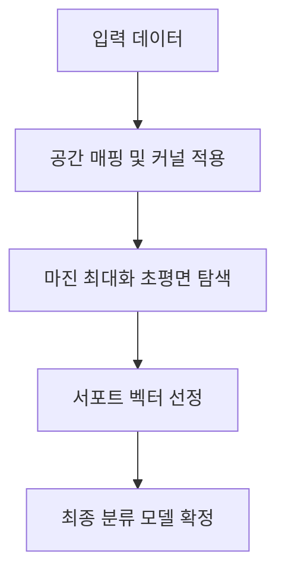

# Support Vector Machines (SVM)

## I. 최대 마진을 통한 결정 경계의 최적화, SVM 개요

**정의**: 데이터가 위치한 공간에서 두 클래스 사이의 거리인 마진( **Margin** )을 최대화하는 최적의 초평면( **Hyperplane** )을 찾아 분류와 회귀를 수행하는 지도 학습 알고리즘  

**특징**:  
( **최대 마진** ) 결정 경계와 데이터 사이의 여유 공간을 극대화하여 미지의 데이터에 대한 일반화 성능 확보  
( **서포트 벡터** ) 전체 데이터가 아닌 결정 경계 형성에 기여하는 핵심 데이터 포인트( **Support Vectors** )만을 사용하여 효율적 연산 수행  
( **커널 트릭** ) 저차원 공간에서 선형 분리가 불가능한 데이터를 고차원으로 매핑하여 비선형 경계를 생성하는 기법  

## II. SVM의 상세 메커니즘 및 구성 요소

### 가. SVM의 분류 메커니즘

### 나. 핵심 구성 요소 및 상세 기능

| 구성 요소 | 상세 설명 | 비고 |
| :--- | :--- | :--- |
| **초평면** | 데이터를 서로 다른 클래스로 분리하는 최적의 **N** 차원 공간 평면 | **Decision Boundary** |
| **마진** | 서포트 벡터와 결정 경계 사이의 수직 거리로 모델의 강건함 지표 | **Distance** |
| **커널 함수** | **RBF**, **Polynomial** 등을 통해 비선형 데이터를 고차원 공간으로 변환 | **Kernel Function** |
| **슬랙 변수** | 모델의 과적합을 방지하기 위해 일부 오분류를 허용하는 유연성 파라미터 | **Soft Margin (C)** |

## III. SVM의 주요 특징 및 기술 동향

### 가. 장점 및 한계점

| 항목 | 상세 내용 | 비고 |
| :--- | :--- | :--- |
| **핵심 장점** | 고차원 공간에서도 효과적이며 과적합에 강건한 특성 보유 | **Robustness** |
| **한계점** | 대규모 데이터셋에서 연산 복잡도 증가 및 적절한 커널 선택의 어려움 | **Complexity** |
| **활용 분야** | 텍스트 분류, 이미지 인식, 생체 정보 분석 등 고차원 데이터 도메인 | **Application** |

### 나. 기술 동향

( **Baseline Model** ) 데이터의 양이 적고 특징의 수가 많은 환경에서 여전히 딥러닝을 대체할 수 있는 강력한 분류 모델로 활용됩니다.  
( **Hybrid Approach** ) 신경망 모델의 마지막 층에서 분류기로 사용되거나, 하이퍼파라미터 최적화 기법과 결합하여 성능을 고도화하는 추세입니다.  
