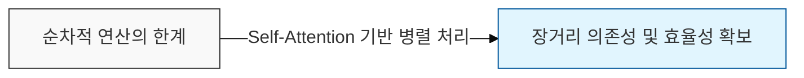
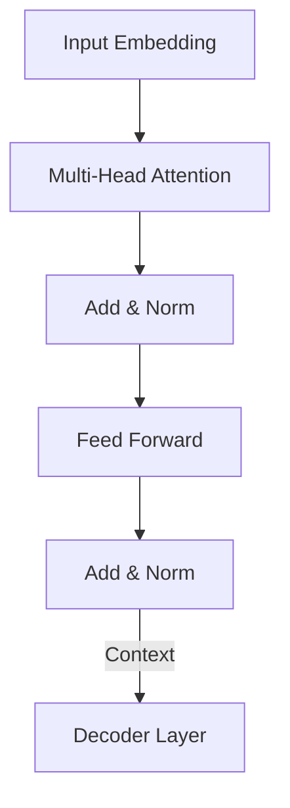

# Transformer

## I. 병렬 처리와 자기 주의 집중, Transformer 개요

**정의**: 순차적 연산이 필요한 **RNN**의 한계를 극복하고, **Self-Attention** 메커니즘을 통해 문장 내 모든 단어 간의 관계를 병렬적으로 처리하는 혁신적인 신경망 아키텍처  

**특징**:  
( **병렬 연산** ) 전체 시퀀스를 한 번에 입력받아 연산하므로 **GPU** 가속 및 대규모 데이터 학습에 최적화  
( **장기 의존성** ) 거리가 먼 단어 간의 관계도 어텐션 메커니즘을 통해 손실 없이 직접 연결  
( **확장성** ) 모델의 크기(파라미터)와 데이터 양을 늘릴수록 성능이 지속적으로 향상되는 특성 보유  

## II. Transformer의 핵심 구성 요소 및 메커니즘

### 가. 인코더-디코더 구조와 어텐션 흐름

### 나. 핵심 기술 요소

| 구성 요소 | 상세 설명 | 핵심 역할 |
| :--- | :--- | :--- |
| **Self-Attention** | 문장 내 각 단어가 다른 단어들과 가지는 연관성을 수치화 | 문맥적 의미 파악 |
| **Multi-Head** | 여러 개의 어텐션을 병렬로 수행하여 다양한 관점의 정보를 수집 | 풍부한 특징 추출 |
| **Positional Encoding** | 순서 정보가 없는 트랜스포머에 위치 정보를 수치적으로 주입 | 시퀀스 순서 유지 |
| **Residual Connection** | 층이 깊어져도 신호가 잘 전달되도록 입력값을 출력값에 더함 | 학습 안정성 확보 |

## III. Transformer의 파급 효과 및 발전 방향

| 항목 | 상세 내용 |
| :--- | :--- |
| **자연어 처리** | **BERT**(이해), **GPT**(생성) 등 현대 모든 **NLP** 모델의 표준 아키텍처 |
| **멀티모달 확장** | 이미지( **ViT** ), 오디오, 비디오 등 모든 도메인으로 확산 |
| **한계 및 과제** | 시퀀스 길이에 비례해 연산량이 제곱으로 증가 (최근 **Linear Attention** 등 연구 중) |

**기술 동향**: 현재 트랜스포머는 단순한 언어 모델을 넘어 **Foundation Model**의 기본 뼈대가 되었으며, 이를 기반으로 한 거대 언어 모델( **LLM** )이 인공지능의 새로운 패러다임을 주도하고 있음
