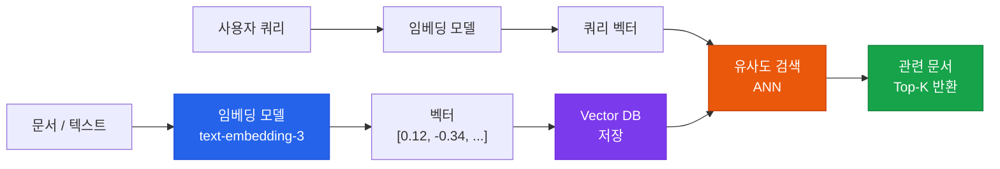

# Vector DB 최적화

의미 기반 검색(Semantic Search)을 위한 벡터 데이터베이스 선택 및 성능 최적화

## Vector DB 작동 원리



## 주요 Vector DB 비교

| DB | 호스팅 | 특징 | 적합한 용도 |
|---|---|---|---|
| **Pinecone** | 관리형 클라우드 | 완전 관리형, 간편한 설정 | 빠른 프로토타이핑, 프로덕션 |
| **Weaviate** | 셀프/관리형 | 멀티모달, 하이브리드 검색 | 복잡한 쿼리, 오픈소스 선호 |
| **Qdrant** | 셀프/관리형 | Rust 기반, 고성능 | 대용량, 성능 중시 |
| **Chroma** | 셀프 호스팅 | 로컬 개발 최적화 | 개발/테스트 환경 |
| **pgvector** | PostgreSQL 확장 | 기존 DB 통합 | 소규모, 단순 사용 사례 |

## 성능 최적화 핵심 지표

### SLA 기준 (프로덕션)
- **P95 응답 시간**: < 100ms
- **P99 응답 시간**: < 200ms
- **가용성**: 99.9% 이상

### 최적화 포인트

**1. 임베딩 모델 선택**
```
text-embedding-3-small: 빠름, 저비용, 1536차원
text-embedding-3-large: 정확도 높음, 3072차원
```

**2. 인덱스 설정**
```
HNSW 파라미터:
  ef_construction: 128~512 (높을수록 정확도↑, 구축 시간↑)
  M: 16~64 (높을수록 정확도↑, 메모리↑)
```

**3. 청킹 전략**
```
청크 크기: 256~512 토큰 (문서 유형에 따라 조정)
오버랩:   50~100 토큰 (문맥 연속성 유지)
```
