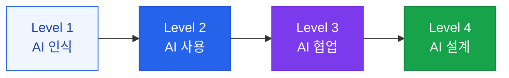

# AI 리터러시 교육

사용자가 AI를 효과적으로 활용하고 한계를 이해할 수 있도록 하는 역량 강화 프로그램

## AI 리터러시 수준 정의



| 수준 | 역량 | 대상 |
|---|---|---|
| **Level 1** | AI가 무엇인지 안다 | 전 직원 |
| **Level 2** | AI 도구를 기본 사용한다 | 전 직원 |
| **Level 3** | AI와 협업해 성과를 낸다 | 주요 직군 |
| **Level 4** | AI 시스템을 설계한다 | 개발자, AI 담당자 |

## 핵심 교육 내용

### 모든 직원 대상 (Level 1-2)

**AI의 본질 이해**:
- AI는 패턴 매칭 기반 확률적 시스템 (100% 정확하지 않음)
- Hallucination이 발생할 수 있으며, 중요한 정보는 검증 필요
- AI는 사용자를 돕는 도구, 최종 판단은 인간이 해야 함

**효과적인 프롬프트 작성**:
- 구체적이고 명확하게 지시할수록 좋은 결과
- 역할, 배경, 원하는 형식을 포함
- 예시를 들어주면 더 정확한 결과

### 개발자/AI 담당자 대상 (Level 3-4)

- RAG 파이프라인 설계 및 평가
- 프롬프트 엔지니어링 심화
- AI 모델 선택 기준 및 비용 최적화
- 윤리적 AI 개발 원칙

## 교육 프로그램 설계

### 온보딩 트랙

```
주 1: AI 기본 개념 + 도구 소개 (4시간)
주 2: 실습 워크숍 + Q&A (4시간)
주 3: 업무 적용 과제 (자율)
주 4: 성과 공유 + 피드백 (2시간)
```

### 지속 학습 체계

- **월간 AI 뉴스레터**: 최신 AI 동향 및 활용 사례
- **분기별 워크숍**: 새로운 AI 도구 실습
- **내부 AI 챔피언**: 부서별 AI 활용 전도사 선발·운영
- **성과 공유 세션**: AI 활용 성공 사례 발표

## AI 활용 가이드라인 예시

**권장 활용**:
- 초안 작성 및 편집 보조
- 데이터 분석 및 요약
- 아이디어 브레인스토밍
- 코드 작성 및 디버깅 보조

**주의 필요**:
- 법적·재정적 의사결정 (반드시 전문가 검토)
- 개인정보가 포함된 작업 (마스킹 후 사용)
- 최종 고객에게 직접 전달되는 콘텐츠 (반드시 검토)
