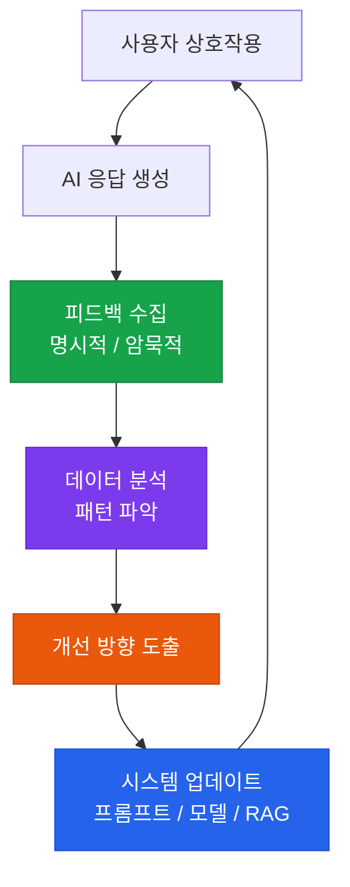

# 피드백 루프

사용자 피드백을 수집하고 AI 시스템 개선에 반영하는 체계적 메커니즘

## 피드백 루프 구조



## 피드백 유형

### 명시적 피드백

사용자가 의도적으로 제공하는 피드백:

| 유형 | UI 요소 | 수집 데이터 |
|---|---|---|
| **이진 평가** | 👍 / 👎 버튼 | 만족/불만족 여부 |
| **별점 평가** | ⭐⭐⭐⭐⭐ | 만족도 점수 |
| **텍스트 피드백** | 코멘트 박스 | 구체적인 개선 의견 |
| **수정 제출** | 편집 후 제출 | 올바른 답변 데이터 |

### 암묵적 피드백

사용자 행동에서 추론하는 피드백:

```
재생성 클릭   → 이전 응답 불만족
복사/붙여넣기  → 응답 활용 (긍정)
중단 후 이탈   → 응답 불만족
후속 질문      → 불명확한 응답
```

## RLHF (인간 피드백 기반 강화학습)

수집된 피드백을 모델 개선에 활용하는 과정:

```
1. 피드백 수집: 좋아요/싫어요 + 선호 응답 선택
   ↓
2. 보상 모델 학습: 선호도 패턴 학습
   ↓
3. PPO 파인튜닝: 보상 모델 기반 LLM 업데이트
   ↓
4. A/B 테스트: 개선된 모델 성능 검증
   ↓
5. 배포: 검증된 모델 프로덕션 반영
```

## 피드백 분석 대시보드

정기적으로 추적해야 할 피드백 지표:

| 지표 | 설명 | 주기 |
|---|---|---|
| **일일 만족도** | 좋아요 / (좋아요 + 싫어요) | 일간 |
| **재생성율** | 전체 응답 중 재생성 요청 비율 | 일간 |
| **피드백 주제 분류** | 불만 이유 카테고리화 | 주간 |
| **개선 전후 비교** | 업데이트 후 만족도 변화 | 배포 후 |

## 빠른 개선 루프 구현

```python
# 피드백 임계값 초과 시 자동 알림
def check_feedback_threshold(metric: str, value: float):
    thresholds = {
        "satisfaction_rate": 0.80,   # 80% 이하면 알림
        "regeneration_rate": 0.20,   # 20% 이상이면 알림
    }
    if metric in thresholds:
        if value < thresholds[metric]:
            send_alert(f"{metric} 임계값 미달: {value:.2%}")
```
