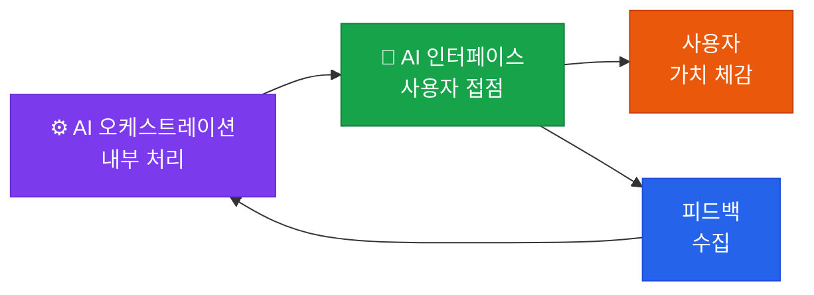

# 🤝 AI 인터페이스

**Human-AI Interaction** — 사용자가 AI의 가치를 실제로 체감하고 상호작용하는 접점 설계

## 이 영역의 역할

AI 인터페이스는 5개 영역 프레임워크에서 **사용자가 AI를 직접 경험하는 유일한 접점**입니다. 아무리 뛰어난 인프라와 오케스트레이션이 있어도, 사용자 경험이 나쁘면 AI 도입은 실패합니다.

## 핵심 구성 요소

| 구성 요소 | 설명 |
|---|---|
| **UI/UX 디자인** | 대화형 인터페이스(CUI), 멀티모달 최적화 |
| **멀티모달 입력** | 이미지, 음성, 도표 등 다양한 입력 처리 및 시각화 |
| **AI 리터러시** | 사용자가 AI를 효과적으로 활용할 수 있는 가이드 |
| **피드백 루프** | 사용자 피드백을 수집해 시스템에 반영 |

## 핵심: 심리적 수용성 관리

인터페이스는 단순히 기술적인 UI 문제가 아닙니다. 사용자의 **심리적 수용성(Psychological Acceptance)**을 관리하는 영역입니다.

- AI가 틀렸을 때 사용자가 어떻게 반응하는가?
- AI 출력에 대한 과신(Over-reliance) 또는 불신(Under-trust)은 없는가?
- 사용자가 AI와 협업하는 방식을 스스로 조절할 수 있는가?

## Health Check 질문

> "사용자들이 AI의 한계를 이해하고 적절히 활용하고 있는가?"

- [ ] AI 인터페이스가 AI임을 명확히 표시하고 있는가?
- [ ] 사용자 피드백(좋아요/싫어요)이 시스템 개선에 연결되어 있는가?
- [ ] 멀티모달 입력이 사용자의 실제 니즈를 반영하는가?
- [ ] AI 리터러시 교육이 정기적으로 제공되고 있는가?
