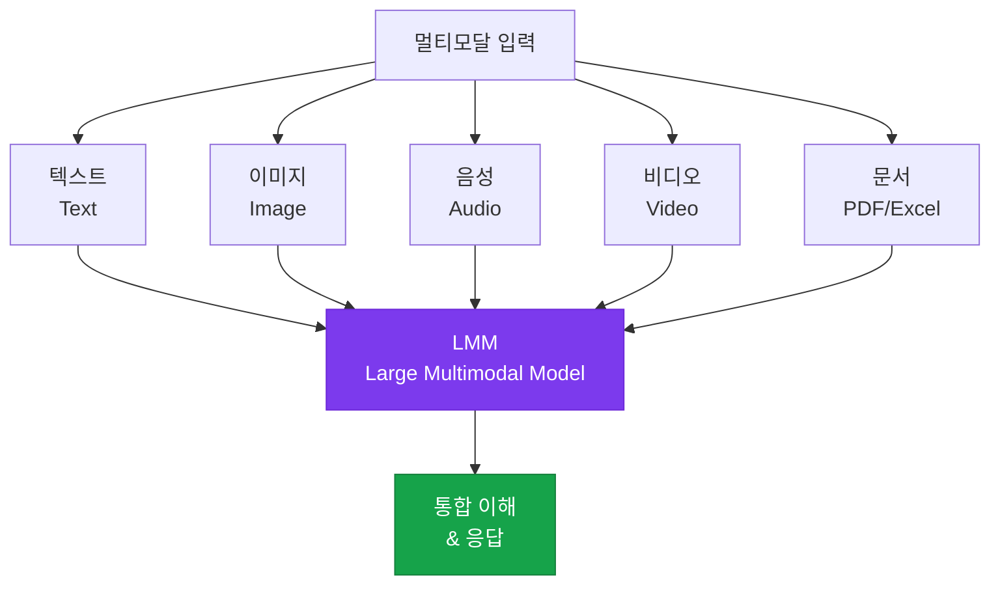

# 멀티모달 인터페이스

이미지, 음성, 도표 등 다양한 입력 모달리티를 활용한 LMM 기반 인터페이스 설계

## 멀티모달 AI 생태계



## 주요 멀티모달 모델 (2025)

| 모델 | 지원 모달리티 | 특징 |
|---|---|---|
| **Claude 3.5+** | 텍스트, 이미지, PDF | 문서 이해, 코드 생성 |
| **GPT-4o** | 텍스트, 이미지, 음성 | 실시간 음성 대화 |
| **Gemini 2.0** | 텍스트, 이미지, 음성, 비디오 | 긴 컨텍스트, 멀티미디어 |
| **Claude 4** | 텍스트, 이미지, PDF | 긴 문서 분석 특화 |

## 이미지 입력 활용 케이스

### 문서 처리

```python
# PDF/이미지 문서를 Claude에 직접 전달
import anthropic, base64

with open("report.pdf", "rb") as f:
    pdf_data = base64.standard_b64encode(f.read()).decode("utf-8")

response = client.messages.create(
    model="claude-sonnet-4-6",
    max_tokens=2048,
    messages=[{
        "role": "user",
        "content": [
            {
                "type": "document",
                "source": {"type": "base64", "media_type": "application/pdf", "data": pdf_data}
            },
            {"type": "text", "text": "이 보고서의 핵심 지표를 요약해 주세요."}
        ]
    }]
)
```

## 시각화 출력 (Streamlit 대시보드)

AI 분석 결과를 시각화하는 대표적인 도구:

```python
import streamlit as st
import anthropic

st.title("AI 분석 대시보드")

uploaded_file = st.file_uploader("파일 업로드", type=["pdf", "png", "jpg"])
user_query = st.text_input("분석할 내용을 입력하세요")

if uploaded_file and user_query:
    # Claude로 분석 요청
    response = analyze_with_claude(uploaded_file, user_query)

    # 결과 시각화
    st.markdown(response.content)
    st.download_button("결과 다운로드", response.content)
```

## 음성 인터페이스 설계 고려사항

- **STT 품질**: 한국어 전문 용어 인식률 확인 (특히 AI 용어)
- **TTS 자연스러움**: 감정적으로 자연스러운 음성 출력
- **응답 길이**: 음성은 텍스트보다 짧게 (청취 집중력 한계)
- **끊김 처리**: 네트워크 지연 시 사용자 경험 유지
