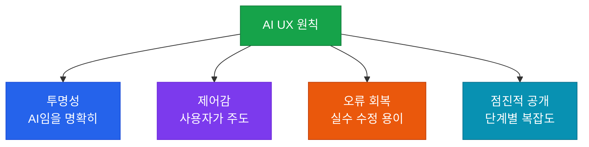

# AI UI/UX 설계

대화형 인터페이스(CUI)와 AI 특화 UX 패턴 설계 원칙

## AI UX의 핵심 원칙



## 대화형 인터페이스(CUI) 설계

### 스트리밍 응답

사용자가 AI가 생각하는 동안 기다리는 느낌을 주지 않도록 **스트리밍**을 사용합니다.

```python
# Claude API 스트리밍 예시
with anthropic.messages.stream(
    model="claude-sonnet-4-6",
    max_tokens=1024,
    messages=[{"role": "user", "content": prompt}]
) as stream:
    for text in stream.text_stream:
        print(text, end="", flush=True)
```

### 로딩 상태 관리

| 상태 | UX 처리 | 예시 |
|---|---|---|
| **단순 쿼리** (< 3초) | 스피너 표시 | 키워드 검색 |
| **복잡한 분석** (3~10초) | 진행 상황 메시지 | "분석 중..." |
| **장기 작업** (> 10초) | 단계별 진행 표시 | "1/3 단계 완료" |

## AI 특화 UX 패턴

### 1. 불확실성 표시

AI가 확신하지 못할 때 사용자에게 명확히 알립니다.

```
✅ "제가 확인한 정보로는 ~입니다. 최신 정보는 공식 사이트를 확인해 주세요."
❌ "~입니다." (불확실한 정보를 확신하는 것처럼 표현)
```

### 2. 수정 가능한 AI 출력

AI 출력을 사용자가 직접 편집하거나 재생성할 수 있게 합니다.

```
[AI 생성 텍스트]
  ↓ 버튼
[편집] [재생성] [다른 버전 보기]
```

### 3. 소스 표시

RAG 기반 시스템에서 답변의 출처를 표시합니다.

```
답변: "반품은 구매 후 30일 이내에 가능합니다."
출처: [고객 서비스 정책 v3.2] (클릭 시 원문 이동)
```

## 피해야 할 안티패턴

- **AI 세탁(AI Washing)**: AI가 아닌 기능을 AI처럼 포장
- **과도한 의인화**: AI를 사람처럼 표현해 과도한 신뢰 유발
- **강요된 대화**: 단순 검색을 굳이 채팅으로 강제
- **불투명한 AI**: AI가 어떤 정보를 기반으로 답했는지 숨김
