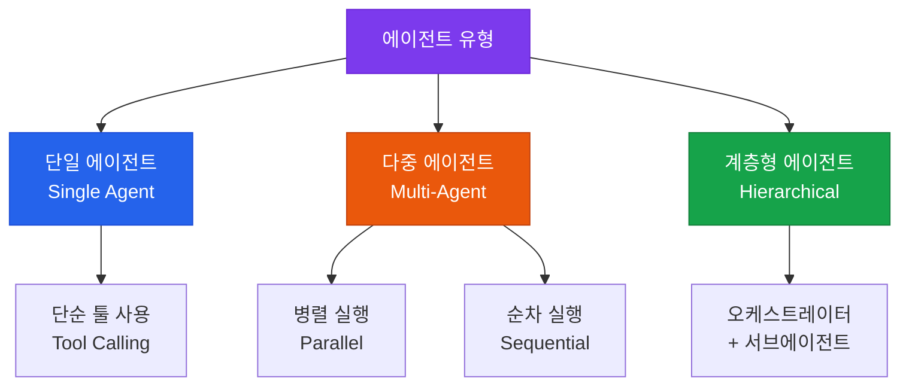

# 에이전트 인터페이스

외부 툴(API) 연동, 다중 에이전트 협업 및 실행 제어

## 에이전트 아키텍처 유형



## Tool Calling 설계 원칙

### 좋은 툴 설계

```python
{
  "name": "search_knowledge_base",
  "description": "회사 내부 지식베이스에서 관련 문서를 검색합니다. 정책, 절차, 기술 문서 등을 찾을 때 사용하세요.",
  "parameters": {
    "query": "검색할 자연어 질문",
    "top_k": "반환할 문서 수 (기본값: 5)",
    "category": "검색 카테고리 (선택사항): hr, technical, policy"
  }
}
```

### 툴 명세의 핵심 원칙
- **명확한 이름**: 동사_명사 형식 (`search_document`, `send_email`)
- **상세한 설명**: AI가 언제 이 툴을 써야 하는지 명확히 기술
- **최소 파라미터**: 필수 파라미터만, 나머지는 선택사항으로

## 다중 에이전트 패턴

### 오케스트레이터-서브에이전트 패턴

```
오케스트레이터 에이전트
├── 리서치 에이전트 (웹 검색, 문서 검색)
├── 분석 에이전트 (데이터 처리, 계산)
├── 코딩 에이전트 (코드 작성, 실행)
└── 요약 에이전트 (최종 보고서 작성)
```

### 주요 프레임워크 비교

| 프레임워크 | 특징 | 적합한 용도 |
|---|---|---|
| **LangGraph** | 상태 그래프 기반, 복잡한 흐름 제어 | 복잡한 워크플로우 |
| **AutoGen** | 대화형 멀티에이전트 | 연구, 협업 태스크 |
| **CrewAI** | 역할 기반 에이전트 팀 | 비즈니스 프로세스 자동화 |
| **Claude Code SDK** | Anthropic 공식, 코딩 특화 | 개발 자동화 |

## 에러 처리 전략

```python
# 에이전트 실행 시 반드시 처리해야 할 예외
try:
    result = agent.run(task)
except ToolExecutionError as e:
    # 툴 실행 실패 → 대안 툴로 재시도
    result = agent.run(task, fallback_tools=True)
except MaxIterationsError:
    # 무한 루프 방지
    result = "최대 반복 횟수 초과. 작업을 더 작게 분해해 주세요."
except ContextLengthError:
    # 컨텍스트 초과 → 요약 후 재시도
    result = agent.run_with_compression(task)
```
