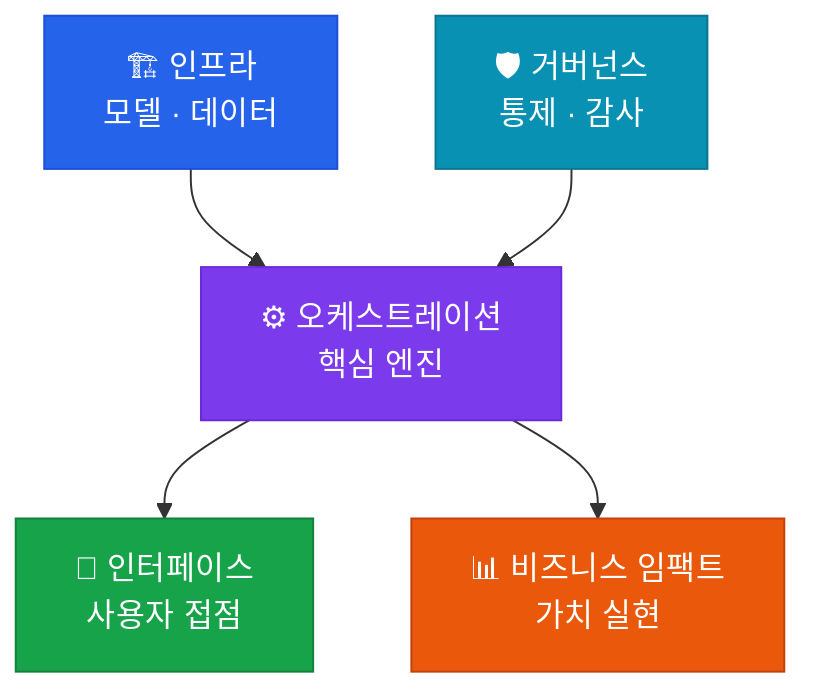

# ⚙️ AI 오케스트레이션

**System Integration & Workflow** — 여러 요소 기술을 결합해 지능적인 워크플로우를 완성하는 핵심 엔진

## 이 영역의 역할

AI 오케스트레이션은 5개 영역 프레임워크의 **핵심 엔진(Engine)**입니다. 인프라가 제공하는 컴퓨팅 자원과 모델을, 실제 비즈니스 문제를 해결하는 워크플로우로 연결합니다.

## 핵심 구성 요소

| 구성 요소 | 설명 |
|---|---|
| **프롬프트 & 컨텍스트 설계** | 고도화된 프롬프트와 RAG 기반 지식 연결 |
| **에이전트 인터페이스** | 외부 툴(API) 연동, 다중 에이전트 협업 |
| **상태 관리** | 에이전트 간 추론의 연속성 유지 |
| **워크플로우 자동화** | 복잡한 비즈니스 로직을 AI가 단계별 수행 |

## 핵심 전략: 에이전틱 환경

'**바이브 코딩(Vibe Coding)**'처럼 자연어로 시스템을 제어하는 **에이전틱 환경** 구축 능력이 이 영역의 승부처입니다.

## Health Check 질문

> "현재 우리 시스템의 오케스트레이션 영역은 에이전트 간 협업이 가능한 수준인가?"

- [ ] RAG 파이프라인의 검색 정확도(Recall@K)가 목표치를 달성하고 있는가?
- [ ] 에이전트가 이전 단계 결과를 기억하고 다음 단계로 논리적으로 넘어가는가?
- [ ] 외부 API 장애 시 에이전트 워크플로우가 적절히 처리(fallback)되는가?
- [ ] 복잡한 비즈니스 로직이 자연어 지시만으로 실행 가능한가?
