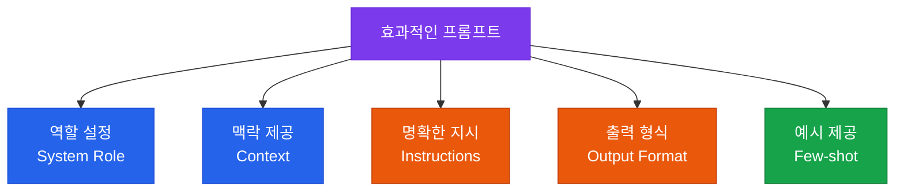

# 프롬프트 & 컨텍스트 설계

고도화된 프롬프트 엔지니어링과 효과적인 컨텍스트 구성 전략

## 프롬프트 구조화 원칙



## 프롬프트 패턴 라이브러리

### 1. Chain-of-Thought (CoT)

복잡한 추론이 필요한 작업에 적합합니다.

```
단계별로 생각하세요:
1. 문제를 분석하세요
2. 각 요소를 검토하세요
3. 결론을 도출하세요
```

### 2. Few-shot 프롬프팅

일관된 출력 형식이 필요할 때 예시를 제공합니다.

```
입력: [예시 입력 1]
출력: [예시 출력 1]

입력: [예시 입력 2]
출력: [예시 출력 2]

입력: [실제 입력]
출력:
```

### 3. ReAct (Reason + Act)

에이전트가 추론과 행동을 반복하는 패턴입니다.

```
생각: [현재 상황 분석]
행동: [수행할 툴/액션]
관찰: [결과 확인]
생각: [다음 단계 계획]
...
최종 답변: [결론]
```

## 컨텍스트 윈도우 관리

| 전략 | 설명 | 적합한 경우 |
|---|---|---|
| **슬라이딩 윈도우** | 오래된 메시지 자동 제거 | 긴 대화 세션 |
| **요약 압축** | 과거 대화를 요약으로 압축 | 대화 히스토리 유지 필요 |
| **RAG 주입** | 필요한 정보만 선별 주입 | 도메인 지식 활용 |
| **프롬프트 캐싱** | 반복 컨텍스트 캐시 활용 | 비용 최적화 |

## 프롬프트 버전 관리

프롬프트도 코드처럼 버전 관리가 필요합니다:

```
prompts/
├── v1.0.0/
│   ├── system.txt
│   └── user_template.txt
├── v1.1.0/
│   ├── system.txt
│   └── user_template.txt
└── production -> v1.1.0/  (심볼릭 링크)
```
