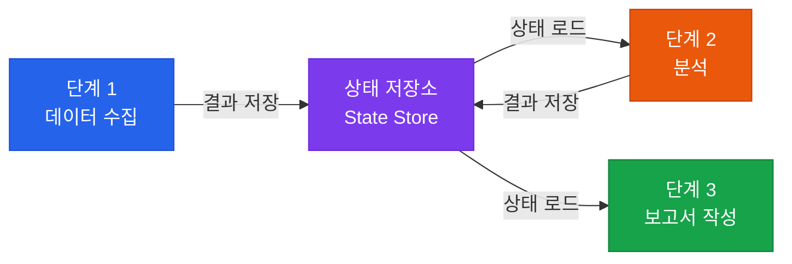

# 상태 관리

복잡한 에이전트 워크플로우에서 추론의 연속성을 유지하는 전략

## 상태 관리의 중요성

복잡한 워크플로우에서 AI가 이전 단계를 기억하고 다음 단계로 논리적으로 넘어가는 **추론의 연속성**을 관리하는 것이 핵심입니다.



## 상태 유형

| 상태 유형 | 지속 기간 | 저장소 | 사용 예 |
|---|---|---|---|
| **인메모리 상태** | 실행 중 | Python dict | 단일 실행 세션 |
| **세션 상태** | 대화 기간 | Redis | 멀티턴 대화 |
| **영구 상태** | 장기 | PostgreSQL | 사용자 선호도, 히스토리 |
| **체크포인트** | 작업 완료까지 | 파일/DB | 장기 실행 워크플로우 |

## LangGraph 상태 관리 예시

```python
from langgraph.graph import StateGraph
from typing import TypedDict, List

class AgentState(TypedDict):
    messages: List[str]
    current_step: str
    collected_data: dict
    analysis_result: str
    is_complete: bool

def research_node(state: AgentState) -> AgentState:
    # 이전 상태를 읽고 새로운 상태를 반환
    data = collect_data(state["messages"][-1])
    return {
        **state,
        "collected_data": data,
        "current_step": "analysis"
    }

graph = StateGraph(AgentState)
graph.add_node("research", research_node)
graph.add_node("analysis", analysis_node)
graph.add_node("report", report_node)
```

## 체크포인팅 전략

장기 실행 워크플로우에서 중간 실패 시 처음부터 재실행하지 않도록:

```python
# 각 단계 완료 후 체크포인트 저장
checkpoint = {
    "step": "data_collection",
    "status": "completed",
    "result": collected_data,
    "timestamp": datetime.now().isoformat()
}
db.save_checkpoint(workflow_id, checkpoint)

# 재시작 시 마지막 체크포인트부터 재개
last_checkpoint = db.load_checkpoint(workflow_id)
if last_checkpoint["step"] == "data_collection":
    skip_to_analysis(last_checkpoint["result"])
```
