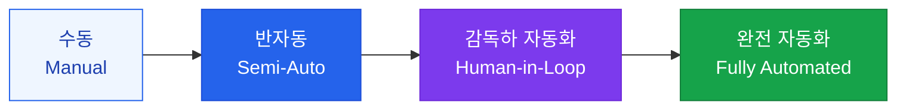

# 워크플로우 자동화

복잡한 비즈니스 로직을 AI가 단계별로 수행하는 워크플로우 엔진

## 자동화 수준 정의



## Human-in-the-Loop 패턴

모든 자동화가 완전 자율적일 필요는 없습니다. **적절한 지점에 사람의 검토**를 배치하는 것이 안전하고 신뢰할 수 있는 시스템을 만듭니다.

```
AI 초안 작성 → [자동 품질 검사] → 사람 검토 → AI 최종 수정 → 발행
                                      ↑
                              이 지점에서 사람이 개입
```

**사람 개입이 필요한 케이스**:
- 법적·재정적 영향이 큰 결정
- 불확실성이 높은 상황 (AI 신뢰도 < 임계값)
- 민감한 개인정보 처리
- 브랜드 리스크가 있는 외부 커뮤니케이션

## 비즈니스 워크플로우 자동화 예시

### 고객 지원 자동화

```
고객 문의 접수
  → 의도 분류 (AI)
  → FAQ 검색 (RAG)
  → 답변 생성 (LLM)
  → 감성 분석 (AI): 부정적이면 인간 에이전트에게 에스컬레이션
  → 답변 발송
  → 만족도 조사
```

### 콘텐츠 생성 자동화

```
주제 입력
  → 리서치 에이전트 (웹 검색 + 내부 DB)
  → 아웃라인 생성 (LLM)
  → 초안 작성 (LLM)
  → 사실 확인 (검색 + 검증)
  → 편집자 검토 [Human checkpoint]
  → SEO 최적화 (AI)
  → 발행
```

## 워크플로우 모니터링

자동화된 워크플로우는 반드시 모니터링이 필요합니다:

| 지표 | 설명 | 알림 임계값 |
|---|---|---|
| **성공률** | 완료된 워크플로우 비율 | < 95% |
| **평균 소요 시간** | 워크플로우 완료까지 걸린 시간 | 기준치 2배 초과 |
| **에스컬레이션율** | 인간 개입이 필요했던 비율 | > 20% |
| **비용/실행** | 워크플로우 1회당 LLM 비용 | 예산 초과 |
